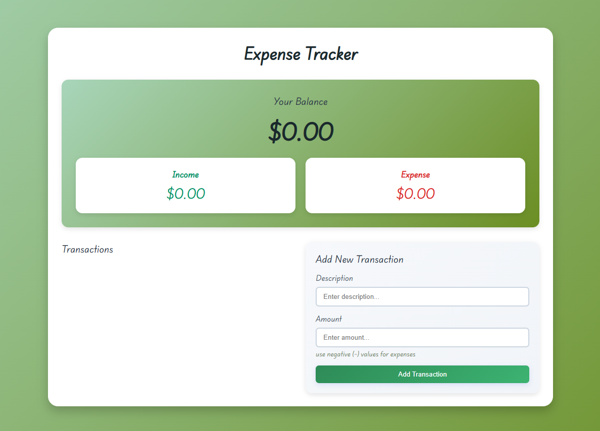

<p align="center">
	
	
	
</p>

# Expense Tracker

A simple, professional, and clean web-based Expense Tracker application. This project allows users to efficiently manage and track their expenses with an intuitive interface.

## Features

- Add, edit, and delete expenses
- Categorize expenses
- View expense history
- Responsive and modern UI
- Data persistence using browser local storage

## Technologies Used

- HTML5
- CSS3
- JavaScript (ES6+)

## Getting Started

1. **Clone the repository**
   ```bash
   git clone https://github.com/Divyansh3105/Expense-Tracker.git
   ```
2. **Navigate to the project directory**
   ```bash
   cd "Expense Tracker"
   ```
3. **Open `index.html` in your browser**
   - No additional setup required.

## Folder Structure

```
Expense Tracker/
│   index.html
│   style.css
│   script.js
│
└───Media/
```

## Screenshots

Add screenshots of your application in the `Media/` folder and display them here:



## License

This project is open source and free to use for any purpose.

---

<div align="center">

## Author

### **Divyansh Garg**

[](https://divyansh3105.github.io/Portfolio/)
[](https://www.linkedin.com/in/divyanshgarg3105)
[](https://github.com/Divyansh3105)
[](mailto:divyanshgarg3105@gmail.com)

**Frontend Developer | UI/UX Enthusiast | Anime Fan**

---

## Show Your Support

**If you like this project, consider giving it a star on GitHub and sharing with fellow Tensura fans!**

---

_"In unity, there is strength. In friendship, there is magic."_

Feel free to use, modify, and share this project!

</div>
